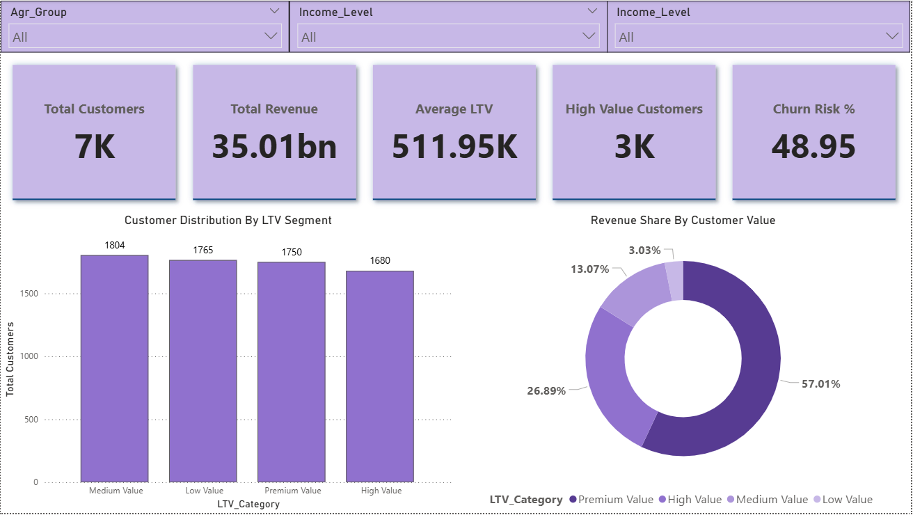

# CLV Finance Dashboard
## 📌 Project Overview
This project analyzes customer behavior data from a digital wallet platform to understand **Customer Lifetime Value (LTV)1**, identify high-value customers, evaluate loyalty and referral impact, and detect churn risk drivers. The insights help businesses improve retention strategies, optimize loyalty programs, and protect revenue from at-risk customers.

# 🎯 Business Objective
A digital wallet company wants to understand what drives customer value and churn risk. By analyzing customer demographics, spending behavior, loyalty participation, referrals, support interactions, and satisfaction levels, the business aims to *identify high-value customers, assess retention risks, and take data-driven actions to improve long-term profitability.*

# 🎯 Project Objectives
- Identify high-value and premium customers contributing most to revenue

- Understand customer distribution across LTV segments

- Analyze the impact of loyalty programs and referrals on customer value

- Detect churn risk among high-value customers

- Evaluate how customer experience (support & satisfaction) influences churn

- Enable actionable insights for retention and revenue protection

# 🛠 Tools & Technologies Used

- **SQL** – KPI calculation and validation

- **Power BI** – Data modeling, DAX, and dashboard creation

- **Power Query** - Data Cleaning & Transformation

- **CSV Dataset** - Main customer level data source.

# 📂 Dataset Description

The dataset contains customer-level information including:

- Customer demographics (Age, Income Level, Location)

- Transaction metrics (Total Spend, Total Transactions, LTV)

- Loyalty and referral metrics

- Customer activity and churn indicators

- Support tickets and issue resolution

- Customer satisfaction scores

# 📐 SQL KPIs

Key KPIs were calculated in SQL and validated in Power BI:

- Total Customers

- Total Revenue

- Average LTV

- LTV by Income Level

- Top Customers by Total Spend

- Churn-risk customers with high LTV

- Satisfaction level vs LTV

These queries were documented as part of the project report.

# 📈 Power BI DAX Measures

Core reusable measures created in Power BI:

- Total Customers

- Total Revenue

- Average LTV

- High Value Customers

- At Risk Customers

- Churn Risk %

- High-Value Customers at Risk

- Average Satisfaction Score

These measures dynamically update with slicers and filters.

# 📊 Dashboard Structure
Page 1: Executive Overview – Customer Value Snapshot

KPI cards (Customers, Revenue, Avg LTV, High-Value Customers, Churn Risk %)

Customer distribution by LTV segment

Revenue share by customer value

Global slicers (Age Group, Income Level, Location)

Purpose: High-level business health overview

Page 2: Customer Value, Loyalty & Referrals Analysis

Average LTV by Loyalty Segment

Revenue contribution by Referral Segment

Customer value distribution by Loyalty Segment

LTV by demographics (Age Group × Income Level matrix)

Purpose: Understand what drives customer value

Page 3: Churn Risk & Customer Experience Insights

Churn risk across LTV categories

High-value customers at risk (KPI card)

Churn risk by customer support ticket load

Satisfaction level vs churn risk (heatmap)

Purpose: Identify risk drivers and retention priorities

# 🔍 Key Insights

- High-value and premium customers contribute a disproportionate share of revenue

- Loyalty programs are strongly associated with higher customer value

- Referral activity influences total revenue more than average LTV

- A significant portion of high-value customers are at churn risk

- Higher support ticket volume correlates with increased churn risk

- Lower satisfaction levels show higher churn concentration

# 💡 Business Recommendations

- Prioritize retention campaigns for high-value at-risk customers

- Strengthen loyalty programs to sustain high-value segments

- Improve customer support efficiency to reduce churn risk

- Use satisfaction scores as an early warning signal for churn

- Focus referral incentives on segments driving the highest revenue

# 📌 Conclusion

This project demonstrates an end-to-end analytics workflow, from raw data to executive-ready dashboards, highlighting real-world skills in **SQL, Power BI, data modeling, business analysis, and storytelling**.